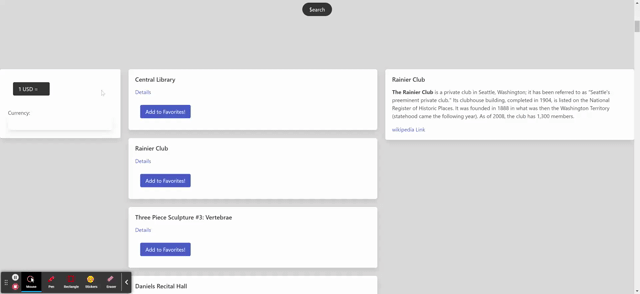
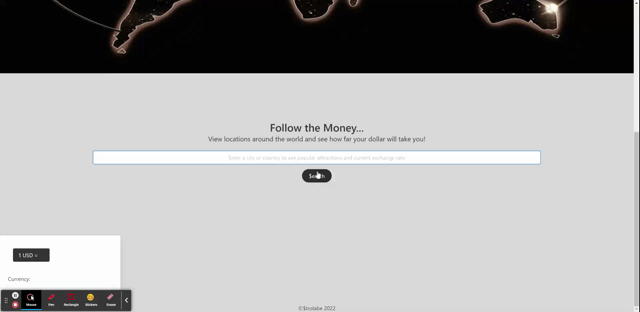
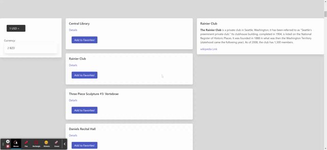

# @$trolabe

## Description

Online travel tool to display currency exchange rate and top attractions for a destination. Allowing fellow travelers to make the best decisions financially without hurting their pockets and to planning the perfect day. Uses JS api to offer real-time information.

## Usage

1. Input travel destination in search bar
2. Select currency for country to determine exchange rate to form a budget
3. Review search results for top local attractions nearby
4. Create a list of your favorites to review
5. Enjoy your trip!

## Preview Images
Selecting which currency to convert to:

Search and click for details + add a favorite:

Goto and browse favorites:

## Links

Url for GitHub Repo: 
https://github.com/KarlOL82/travel_money

Url for Live Page:
https://karlol82.github.io/travel_money/index.html

## Credits

1. [Avleen Dhillon](https://github.com/adhillon0817)
2. [Andre' Grady](https://github.com/Grady253)
3. [Karl Linfeldt](https://github.com/KarlOL82)
4. [Ryan Merced](https://github.com/ryanmerced)
5. [Benjamin Stanfield](https://github.com/Doompeck)
